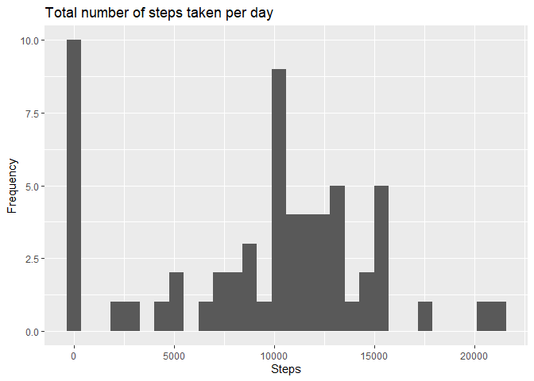
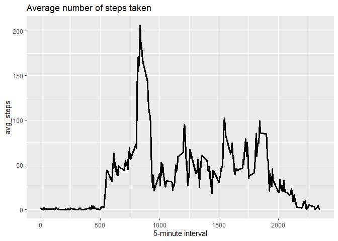
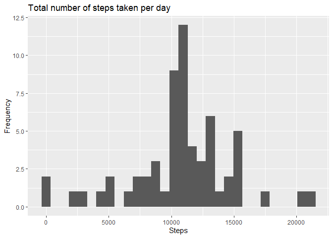
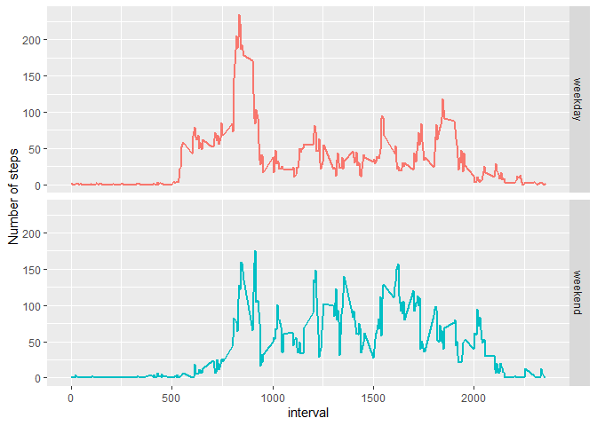

Loading and preprocessing the data
----------------------------------

    activity<-read.csv("activity.csv")
    activity$date<-as.Date(activity$date,format="%Y-%m-%d")

What is mean total number of steps taken per day?
-------------------------------------------------

##### 1.Loading libraries.

    library(dplyr)
    library(ggplot2)

##### 2.Calculation of the total number of steps taken per day.

    total_steps_perday<-activity%>%group_by(date)%>%
            summarize(total_steps = sum(steps, na.rm = TRUE))

##### 3.Making a histogram of the total number of steps taken each day.

    ggplot(total_steps_perday, aes(x =total_steps )) +                          
            geom_histogram() +
            labs( x = "Steps", y="Frequency")+
            ggtitle("Total number of steps taken per day")

##### 4.Finding mean and median of steps taken per day.

    mean(total_steps_perday$total_steps, na.rm = TRUE)

    ## [1] 9354.23

    median(total_steps_perday$total_steps, na.rm = TRUE)

    ## [1] 10395

What is the average daily activity pattern?
-------------------------------------------

##### 1.Calculate average steps grouped by the interval.

    avg_steps_5min<-activity%>%group_by(interval)%>%
            summarize(avg_steps = mean(steps, na.rm = TRUE))

##### 2.Making a time series plot of the 5-minute interval (x-axis) and the average number of steps taken, averaged across all days (y-axis).

    ggplot(avg_steps_5min, aes(x=interval, y=avg_steps)) +
            geom_line(size = I(1.2)) + 
            xlab("5-minute interval")+
            ggtitle("Average number of steps taken")

##### 3.Finding which 5-minute interval contains the maximum number of steps.

    pos_max <- which.max(avg_steps_5min$avg_steps)
    avg_steps_5min[pos_max,1]

    ## # A tibble: 1 x 1
    ##   interval
    ##      <int>
    ## 1      835

Imputing missing values
-----------------------

##### 1.The total number of missing values in the dataset

    sum(is.na(activity$steps))

    ## [1] 2304

##### 2.Filling in all of the missing values with the mean for that 5-minute interval and creating a new dataset with no missing values.

    activity1 <- activity %>%
            left_join(activity%>%
                              group_by(interval) %>%
                              summarise(mean_steps = mean(steps, na.rm = TRUE)), 
                      by = c("interval"))%>%
            mutate(steps = ifelse(is.na(steps), mean_steps, steps))%>%
            select(-mean_steps)

##### 3.A histogram of the total number of steps taken each day.

    total_steps_perday1<-activity1%>%group_by(date)%>%
            summarize(total_steps = sum(steps, na.rm = TRUE))

    ggplot(total_steps_perday1, aes(x =total_steps )) +                          
            geom_histogram() +
            labs( x = "Steps", y="Frequency")+
            ggtitle("Total number of steps taken per day")

##### 4.Calculating mean and median of steps taken per day.

    mean(total_steps_perday1$total_steps, na.rm = TRUE)

    ## [1] 10766.19

    median(total_steps_perday1$total_steps, na.rm = TRUE)

    ## [1] 10766.19

Are there differences in activity patterns between weekdays and weekends?
-------------------------------------------------------------------------

##### 1.Creating a new factor variable in the dataset with two levels – “weekday” and “weekend” indicating whether a given date is a weekday or weekend day.

    Sys.setlocale(category = "LC_ALL", locale = "english")

    ## [1] "LC_COLLATE=English_United States.1252;LC_CTYPE=English_United States.1252;LC_MONETARY=English_United States.1252;LC_NUMERIC=C;LC_TIME=English_United States.1252"

    activity$weekday<-weekdays(activity$date)
    activity$weekday[activity$weekday%in%c("Saturday", "Sunday")]<-"weekend"
    activity$weekday[activity$weekday!="weekend"]<-"weekday"
    activity$weekday<-factor(activity$weekday)

##### 2.Make a panel plot containing a time series plot of the 5-minute interval (x-axis) and the average number of steps taken, averaged across all weekday days or weekend days (y-axis).

    avg_steps_week<-activity%>%group_by(interval, weekday)%>%
            summarize(avg_steps = mean(steps, na.rm = TRUE))

    ggplot(avg_steps_week, aes(interval, avg_steps, colour = factor(weekday))) + 
            geom_line(size = I(1), show.legend = FALSE)+
            facet_grid(rows = vars(weekday))+
            ylab("Number of steps")

